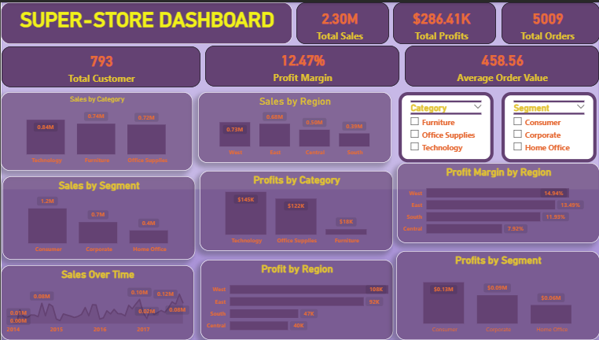

## Power BI Superstore Dashboard

## About the project
This is a Power BI dashboard I created using the Superstore dataset.

The main goal was to practice analyzing sales, profit, customers, and orders and presenting the results in an interactive dashboard.

## Tools I used
- Power BI
- Power Query
- Dax

## What I analyzed

  - Total sales
  - Total profits
  - Orders
  - Customers
  - Profit margin
  - Sales by category
  - Sales by region
  - Sales by segment
  - Profit by category and region
  - Sales over time
 
  ## Dashboard
  

  ## What I Learned

  Through this project I practiced:
  - Cleaning data
  - Creating DAX measures
  - Creating KPIs
  - Using slicers
  - Creating charts
  - Building an interactive dashboard
  - Finding useful information from data

This is my first project as I continue learning data anlytics.
